# Debug-me Revolution — Task Management Flowchart Diagram

> แผนผังระบบจัดการ Task ของ Debug-me: Personal Life Operating System

---

## 1. ภาพรวมระบบ Task Management (System Overview)

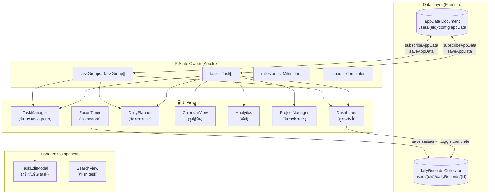

---

## 2. Data Model (โครงสร้างข้อมูล)

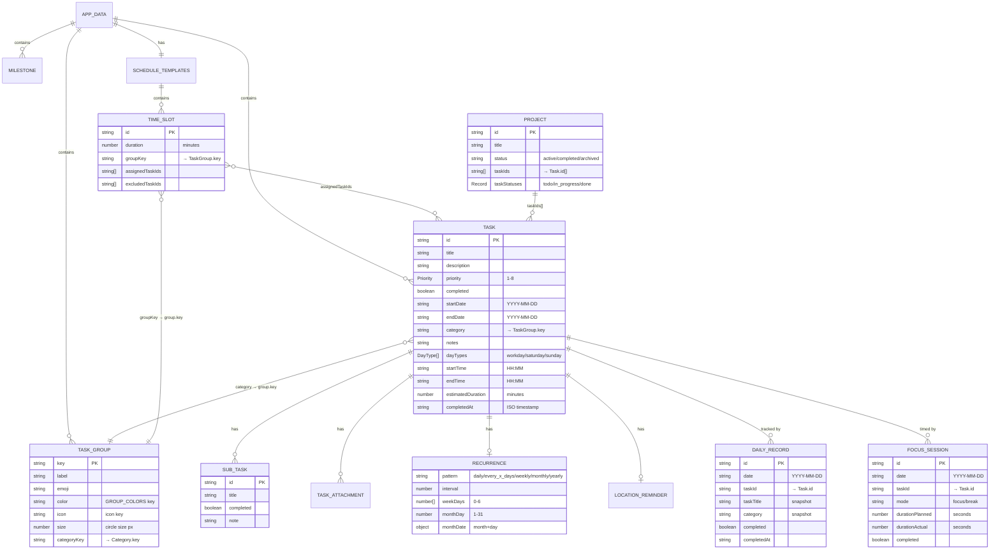

---

## 3. Task Lifecycle Flow (วงจรชีวิตของ Task)

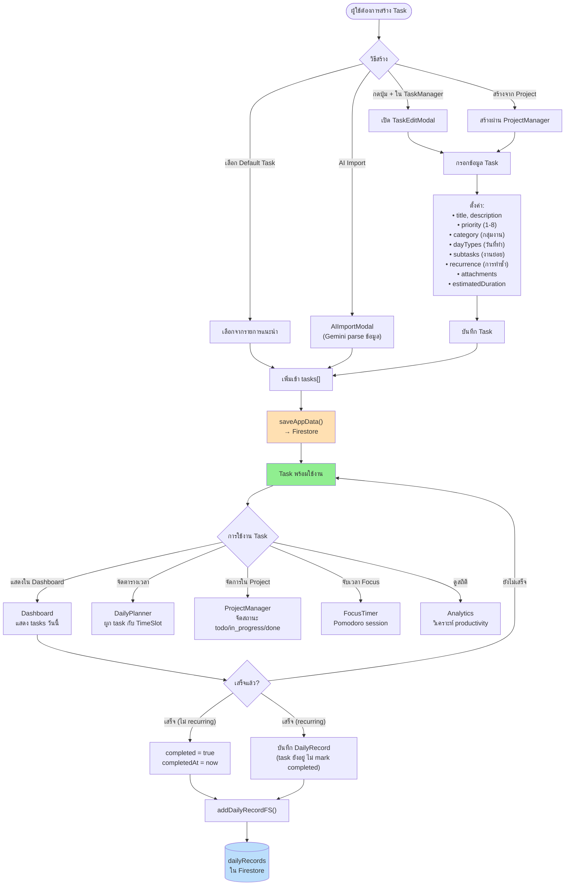

---

## 4. Task Group System (ระบบกลุ่มงาน — Bubble UI)

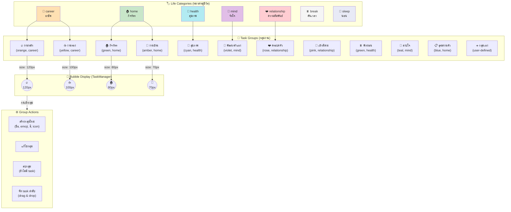

---

## 5. Task Completion Flow (การ complete task)

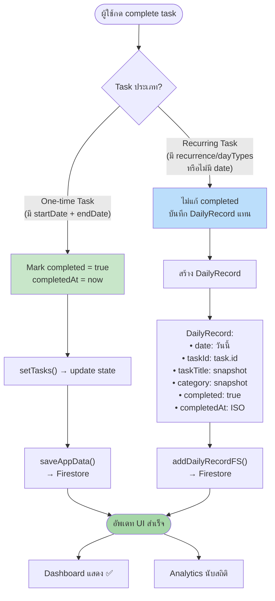

---

## 6. Schedule Integration Flow (Task × Planner)

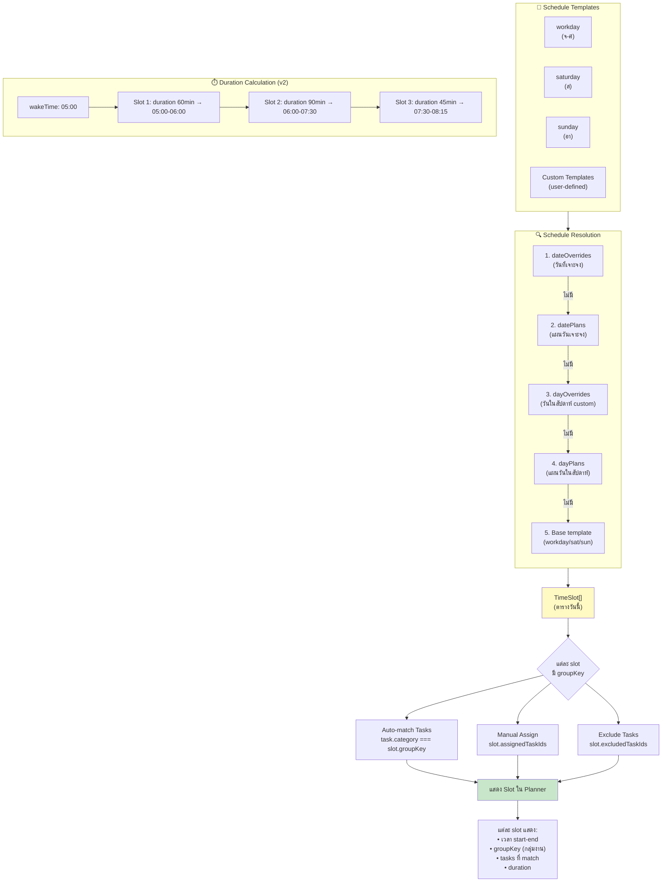

---

## 7. Priority System (ระบบ Priority 8 ระดับ)

```mermaid
flowchart LR
    subgraph Priorities["🎯 Priority Levels (1-8)"]
        direction TB
        P1["1 ต่ำสุด<br/>🟫 slate-100"]
        P2["2 ต่ำ<br/>🔵 blue-100"]
        P3["3 ปกติ-<br/>🔷 cyan-100"]
        P4["4 ปกติ ⭐ default<br/>🟢 emerald-100"]
        P5["5 ปานกลาง<br/>🟡 yellow-100"]
        P6["6 สูง<br/>🟠 amber-100"]
        P7["7 สำคัญ<br/>🟧 orange-100"]
        P8["8 เร่งด่วน<br/>🔴 rose-100"]
    end

    subgraph Legacy["📦 Legacy Migration"]
        Low["'Low' → 2"]
        Med["'Medium' → 4"]
        High["'High' → 7"]
    end

    Legacy -->|"migrateLegacyPriority()"| Priorities

    subgraph Usage["📊 ใช้ Priority ตรงไหน"]
        TaskCard["Task Card<br/>(แสดงสี + label)"]
        Sorting["เรียงลำดับ Task"]
        Dashboard["Dashboard<br/>(งานสำคัญขึ้นก่อน)"]
        QuickAccess["งานด่วน ⚡ / นัดหมาย 📅"]
    end

    Priorities --> Usage

    style P4 fill:#C8E6C9
    style P8 fill:#FFCDD2
    style P1 fill:#F5F5F5
```

---

## 8. Recurrence System (ระบบทำซ้ำ)

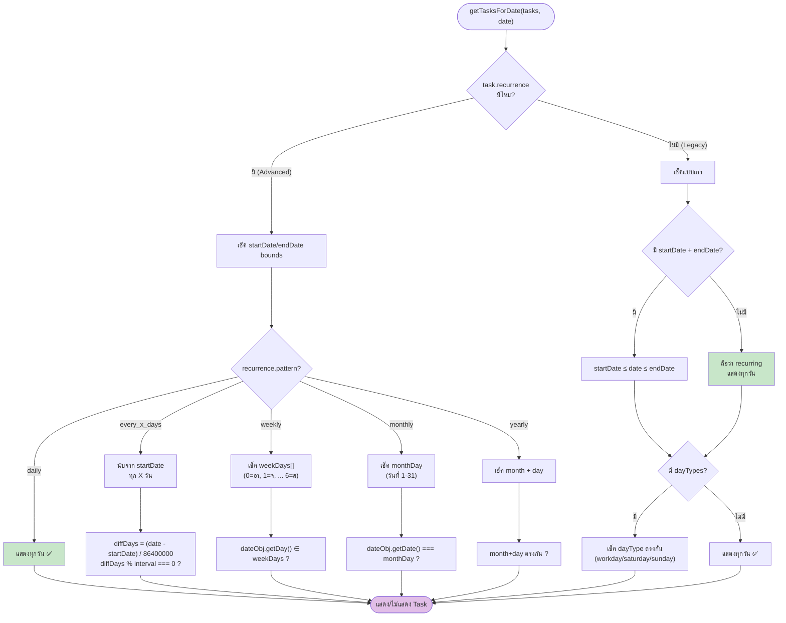

---

## 9. Data Persistence Flow (การบันทึกข้อมูล)

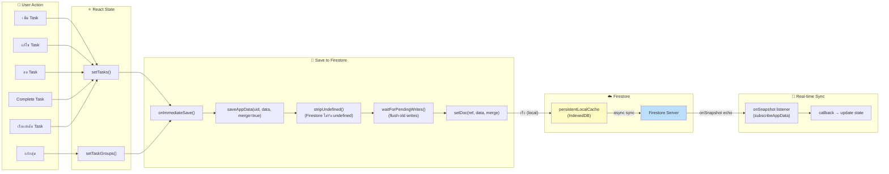

---

## 10. Task × Project Integration (Task กับ Project)

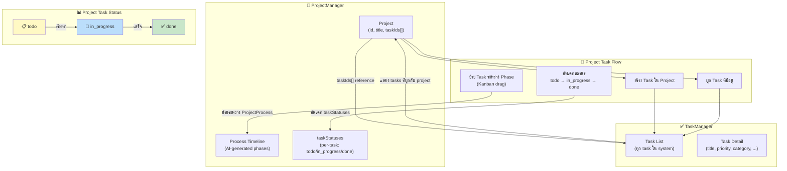

---

## 11. Search & Filter Flow (การค้นหา Task)

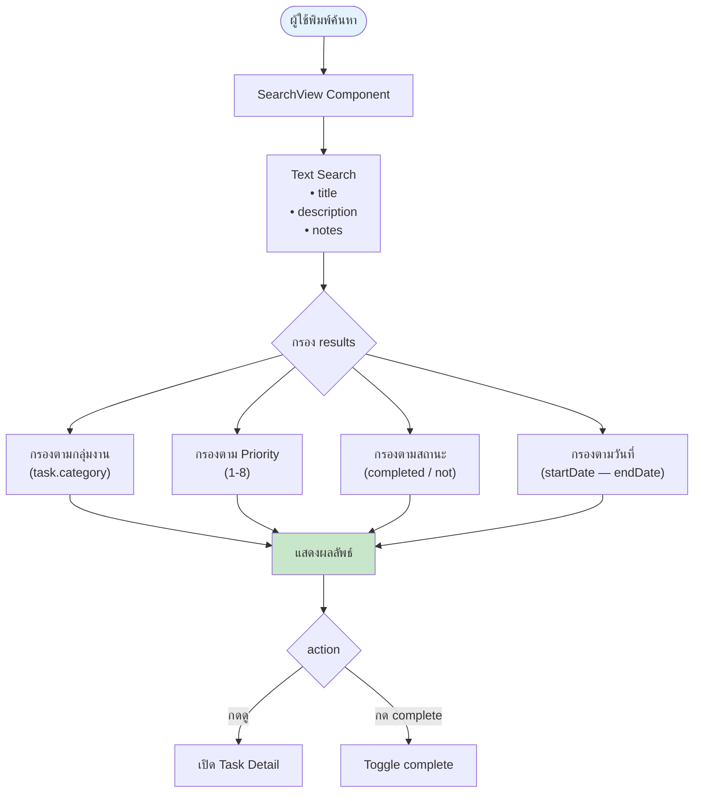

---

## 12. Quick Access System (งานด่วน & นัดหมาย)

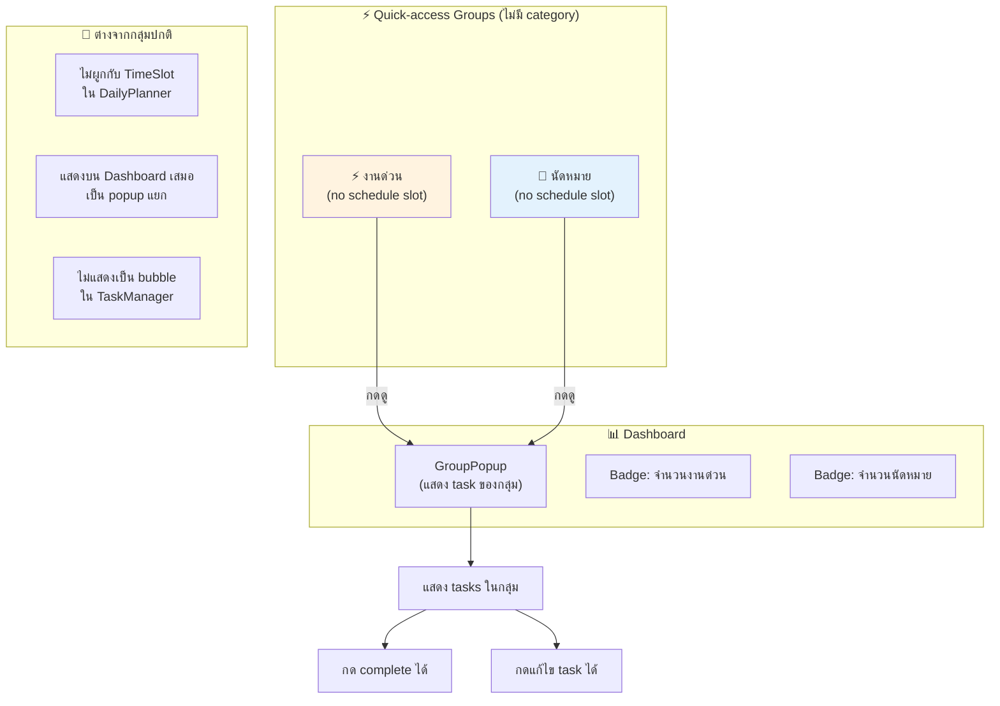

---

## 13. Full User Journey (เส้นทางผู้ใช้รายวัน)

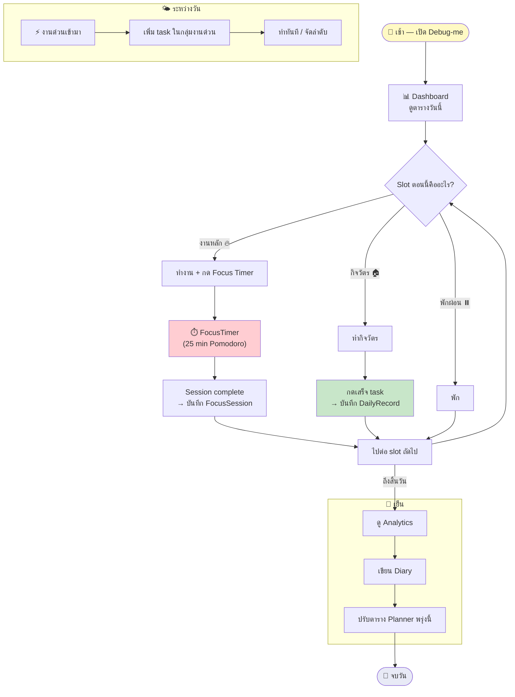

---

## Legend (คำอธิบายสัญลักษณ์)

| Symbol | Meaning |
|--------|---------|
| 🟢 Green | สำเร็จ / Complete |
| 🔵 Blue | ข้อมูล / Data |
| 🟡 Yellow | กำลังดำเนินการ / Active |
| 🟠 Orange | บันทึก / Save operation |
| 🔴 Red | สำคัญ / Critical |
| 🟣 Purple | ผลลัพธ์ / Result |
| ⬜ Gray | ค่าเริ่มต้น / Default |

---

*สร้างเมื่อ: 9 เมษายน 2569*
*อ้างอิง: types.ts, App.tsx, TaskManager.tsx, TaskEditModal.tsx, firestoreDB.ts, Dashboard.tsx*
